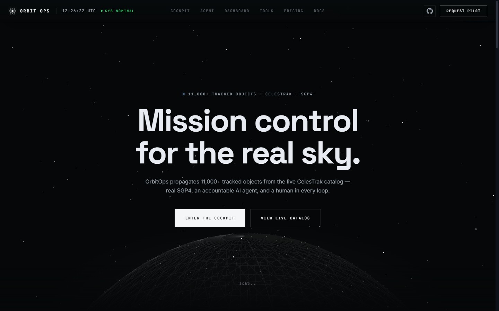
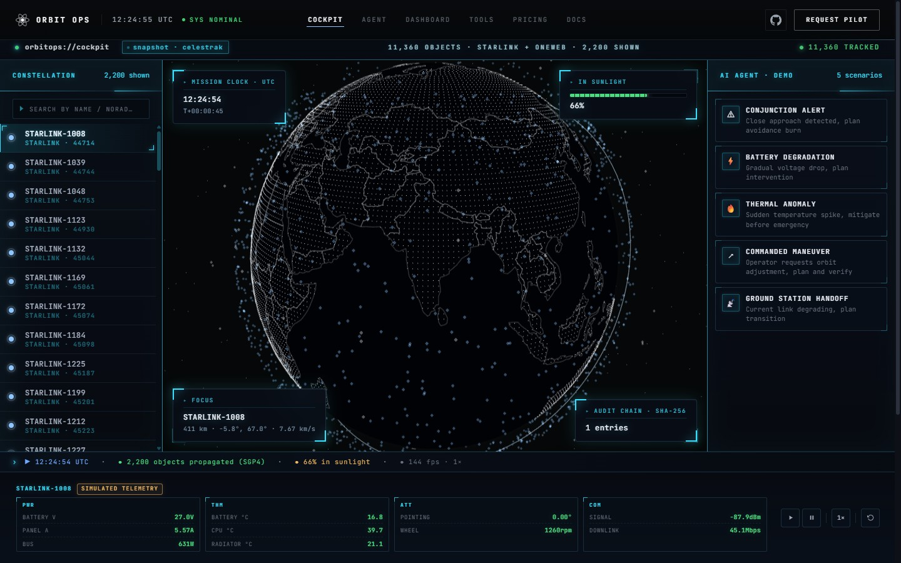
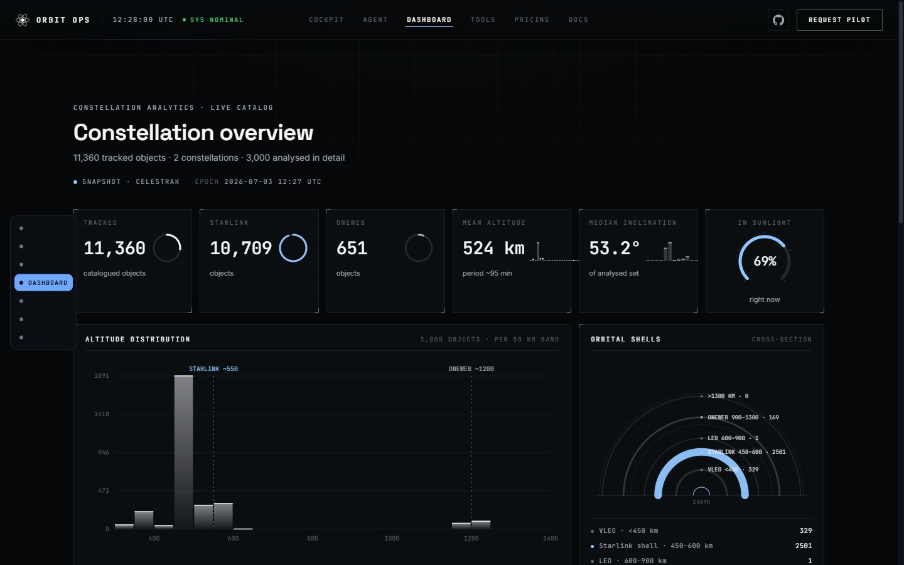

# OrbitOps

> **An open-source mission-control cockpit for satellite constellations — real orbital mechanics in the browser, AI that proposes, humans who approve, and a tamper-evident record of every decision.**

[](LICENSE)
[](CHANGELOG.md)
[](#quick-start)
[](#run-and-verify-it-yourself)
[](https://www.npmjs.com/package/create-orbitops)

### 🛰️ [**Try the live demo**](https://orbitops.shypot.com)

The public demo runs the whole thing — the static app **and** the Node backend —
on a single Cloudflare deployment, so conjunction screening, deorbit compliance
and AI triage show real backend output live.



| | |
|---|---|
|  |  |

---

## Why OrbitOps exists

Small and mid-size constellation operators drown in collision alerts, triage anomalies by
hand, and stitch operations together across STK, spreadsheets and scripts. The tools that
help are either **closed SaaS** you can't self-host or audit (Kayhan, Neuraspace, Cognitive
Space), or **open telemetry viewers with no AI at all** (NASA OpenMCT, Yamcs, OpenC3 COSMOS).

OrbitOps is the missing piece: the **first open-source, browser-native, human-in-the-loop,
_auditable_ AI copilot for mission operations.** The AI *proposes*, a human *approves*, and
every decision lands in a cryptographically tamper-evident log — so you can defend it to a
regulator or an insurer.

---

## Problems OrbitOps solves

| Without OrbitOps | With OrbitOps |
|---|---|
| ❌ A firehose of conjunction alerts (hundreds/week/sat), almost all noise, screened by hand. | ✅ A screener computes a **NASA-validated probability of collision**, auto-dismisses sub-1e-6 noise, and surfaces the handful that matter — ranked, with evidence. |
| ❌ Anomalies triaged manually — expensive, slow, error-prone as the fleet grows. | ✅ **MAD z-score triage** over each satellite's own baseline, severity-ranked, with an on-call escalation policy attached. |
| ❌ AI tools you can't trust to command a multi-million-dollar asset. | ✅ **Human-in-the-loop by construction** — deterministic physics decides, the LLM only advises, nothing executes without an authenticated human sign-off. |
| ❌ A decision you can't prove or defend after the fact. | ✅ Every decision is written to a **tamper-evident HMAC hash chain**; export a one-click evidence pack (JSON/CSV) for an insurer or regulator. |
| ❌ FCC 5-year deorbit + debris reporting done in spreadsheets. | ✅ A **King-Hele deorbit-compliance engine** (5-/25-year regime, honest uncertainty band), sealed into the audit trail. |
| ❌ Ops scattered across STK + spreadsheets + custom scripts. | ✅ **One integrated browser OS** — catalog, 3D cockpit, triage queue, compliance, audit and tools in a single surface. |
| ❌ Closed-SaaS lock-in, or copyleft (AGPL) you can't embed. | ✅ **MIT** throughout — self-host it, fork it, bring your own model and your own data feed, zero vendor lock. |

---

## What makes OrbitOps different

- **First open-source HITL AI copilot for mission ops** — every incumbent is either closed SaaS or has no AI copilot at all.
- **Tamper-evident audit native to space ops** — a hash-chained, HMAC-signed record of every decision; no incumbent advertises this.
- **Real, validated math — not a chatbot.** The conjunction Pc is validated against **NASA CARA's own reference vector to ~3×10⁻⁶**; the LLM is advisory-only and env-gated.
- **MIT, not AGPL/proprietary** — permissive, embeddable, no copyleft virality.
- **Browser-native, zero-install** — OpenMCT is viz-only; Yamcs/COSMOS need servers and containers. OrbitOps runs from a static host and works offline.
- **Integrates _on top of_ your stack** — designed to sit as a copilot + audit layer over Yamcs/COSMOS/OpenMCT and public CDM/OMM/CelesTrak data, not to replace them.

---

## Features

| | | |
|---|---|---|
| 🛰️ **Real orbital catalog** — 11,000+ catalogued objects, live CelesTrak TLEs + offline snapshot, SGP4 in the browser. | 🧠 **Multi-agent HITL copilot** — a LangGraph pipeline (supervisor → specialists → critic → drafter) files a *pending* proposal a human approves. | 🎯 **NASA-validated conjunction Pc** — full-covariance 2D (Foster/CARA), matched to NASA's reference to ~3×10⁻⁶. |
| 🔗 **Tamper-evident audit** — SHA-256 in the browser, HMAC hash chain on the backend, `verify` + JSON/CSV evidence export. | 📉 **Anomaly triage** — modified z-score (median/MAD) over each satellite's baseline, with on-call escalation. | 🚀 **Avoidance-burn planning** — ranked along-track / radial / cross-track burns (Clohessy-Wiltshire + Tsiolkovsky). |
| 📡 **CDM & OMM ingest** — dependency-free CCSDS parsers; screen a real conjunction message end-to-end. | 🌍 **FCC deorbit compliance** — King-Hele orbital-lifetime engine, 5-/25-year regime, sealed to audit. | 🔌 **Bring your own model** — any OpenAI-compatible endpoint (OpenRouter, OpenAI, xAI, Groq, self-hosted). |
| ☁️ **One-Cloudflare deploy** — static app + Node backend in one Worker + Container, no second vendor. | 📦 **One-command self-host** — `npm create orbitops`, zero build, boots straight to the dashboard. | 🔐 **Multi-tenant + RLS** — per-tenant isolation, Postgres Row-Level Security, four-eyes countersign. |

---

## What is real vs. what is simulated

We publish this table because a demo that blurs the line is a demo you can't trust.

| Component | Status | Detail |
|---|---|---|
| Satellite catalog | **Real** | Live TLEs from CelesTrak (Starlink, OneWeb, stations) with a bundled offline snapshot — **11,000+ real catalogued objects**. |
| Orbit propagation | **Real** | SGP4 in the browser (vendored satellite.js); classical Kepler for the demo constellation and tools. |
| Conjunction Pc | **Real · NASA-validated** | Full-covariance 2D Pc (Foster-1992 / CARA), validated to ~3×10⁻⁶ vs NASA's reference and cross-checked by a second quadrature. Deterministic, no LLM. |
| Backend API | **Real** | Node + TypeScript (Fastify): authenticated REST + WebSocket, per-tenant isolation, real Postgres in prod (in-process pglite for zero-setup dev). |
| Audit log | **Real** | Append-only, tamper-evident hash chain — SHA-256 in the browser, keyed **HMAC** on the backend, `verify` + JSON/CSV export. |
| Multi-agent AI copilot | **Real · deterministic; optional BYO LLM** | Deterministic scoring/planning runs with **no key**; the optional LLM only adds an advisory note and points at any OpenAI-compatible endpoint. |
| Per-satellite telemetry | **Real (your fleet) · simulated in the keyless demo** | The backend ingests and serves real telemetry; no public feed exposes a spacecraft's internal health, so the keyless demo labels those streams as simulated until you connect your own feed. |
| In-browser AI scenarios | **Demo** | The 5 in-browser scenario chains are scripted demonstrations over deterministically computed numbers. The real pipeline is the backend copilot above. |
| Accuracy percentages | **Not published** | There is no pilot fleet, so there are no precision/lead-time numbers. We won't invent them. |

---

## Quick start

**Scaffold your own copy in one command** — no build, no signup, no keys:

```bash
npm create orbitops@latest my-ops
# or: npx create-orbitops my-ops
cd my-ops && npm run dev          # static app on http://localhost:8080
```

This drops a self-host build (operator mode: boots straight to the dashboard, marketing
hidden). Prefer to clone directly? It's a static site — any server works:

```bash
git clone https://github.com/veter391/orbitops && cd orbitops && npx serve .
```

Optional: add a model-provider key in Settings (OpenRouter, OpenAI, xAI/Grok, or your own
OpenAI-compatible endpoint) to switch the reasoning console from simulated to live LLM output.

To run the **backend** (real API, audit, agent) locally:

```bash
cd backend && npm install && npm run migrate && npm run dev   # http://127.0.0.1:8790
```

---

## Architecture

```
                        browser (everything runs here, standalone)
 ┌──────────────────────────────────────────────────────────────────┐
 │  index.html → src/main.js → src/router.js (History API)          │
 │  cockpit · dashboard · agent · tools · docs                     │
 │  core/  sgp4 · kepler · maneuver · anomaly · audit · llm-provider│
 └───────────────────────────────┬──────────────────────────────────┘
                                 │ opt-in "connected mode" (HTTP + WebSocket)
                                 ▼
 ┌──────────────────────────────────────────────────────────────────┐
 │  BACKEND (Node + TypeScript, Fastify)                            │
 │  auth (API key / WS ticket) → proposals · telemetry · audit ·   │
 │  events · LangGraph multi-agent graph → pending proposal        │
 └───────────────────────────────┬──────────────────────────────────┘
                                 ▼   Db interface: pglite (dev) → Postgres (prod)
```

Vanilla-JS ES modules, Three.js vendored, no framework, no bundler. **Demo mode always works
with zero backend; connected mode is additive and never breaks it.** Deep dives:
[docs/ARCHITECTURE.md](docs/ARCHITECTURE.md) · [docs/SYSTEM-GUIDE.md](docs/SYSTEM-GUIDE.md).

---

## AI: bring your own model

The reasoning pipeline runs over numbers deterministic flight-dynamics code has already
computed — the LLM interprets, it never invents telemetry or delta-v, and nothing executes
without human approval.

- **Not locked to any vendor.** Point the optional LLM at any **OpenAI-compatible endpoint**: OpenRouter, OpenAI, xAI (Grok), Groq, self-hosted vLLM/Ollama, or a gateway. The key lives only in your browser's localStorage.
- **Deterministic core, no key required.** Screening, planning and compliance run with zero external dependencies; the LLM only ever adds an advisory note.
- **Graceful degradation.** If a model is saturated the chain falls through; if everything fails, the UI keeps the deterministic output.

---

## Roadmap

Big phases, not point fixes. ✅ shipped · ◐ in progress · ⬜ planned. The full working backlog lives in
[docs/SYSTEM-GUIDE.md](docs/SYSTEM-GUIDE.md); everything unshipped is labelled **PLANNED** in
the UI until it ships.

**✅ Phase 0 — Browser mission-control foundation** _(v0.1.0)_
> Zero-build 3D cockpit over the real catalog, SGP4 + Kepler math, an in-browser deterministic agent, a hash-chained audit log, flight tools, and honest real-vs-simulated labelling.

**✅ Phase 1 — Production backend & auditable multi-agent core**
> Hardened Fastify backend; LangGraph multi-agent copilot (supervisor → specialists → critic → drafter → HITL); NASA-validated full-covariance Pc; CDM + OMM ingest; durable interrupt/resume + four-eyes countersign; Postgres RLS multi-tenancy; one-click evidence-pack export; evals-gated CI; one-Cloudflare deploy; `create-orbitops` self-host.

**◐ Phase 2 — Operator-grade experience & trust** _(in progress)_
> Shipped so far: **versioned documentation**, **streaming LLM reasoning** in the console, and **end-to-end + accessibility checks in CI** (axe-core WCAG gate). Remaining: a high-contrast, dense, low-motion **"console mode"** for real operators alongside the cinematic demo, and cross-browser hardening.

**⬜ Phase 3 — Live space-situational-awareness & standards depth**
> Real credentialed feeds (Space-Track / LeoLabs / 18 SDS); fleet-wide ground-contact / pass scheduling; full 3D / Monte-Carlo Pc; OEM + CCSDS SLE; OpenMCT / Yamcs interop as a copilot + audit layer.

**⬜ Phase 4 — Hosted tier & horizontal scale**
> Managed Postgres / TimescaleDB for durable multi-tenant data; Redis-backed event bus + multi-instance; SSO (OIDC) + expanded RBAC; a real secrets manager; durable demo data.

**⬜ Phase 5 — Compliance & first pilot**
> SOC 2 Type I → II; ISO 27001; EU data residency; automated FCC / ITU filings; a pilot operator in the loop.

---

## FAQ

**Do I need an API key or an LLM to run it?**
No. The deterministic core — screening, planning, compliance, audit — works with zero keys and
zero network. An LLM is optional and only adds an advisory note.

**Is the AI making the decisions?**
No. Deterministic physics decides *what* to propose; a human approves, rejects or modifies it.
There is no code path from "the agent decided X" to "X happened" without an authenticated human
action, and every step is in the audit chain.

**Can I use my own model provider?**
Yes — any OpenAI-compatible endpoint (OpenRouter, OpenAI, xAI/Grok, Groq, self-hosted). The key
is stored only in your browser and sent only to the endpoint you set.

**Is the demo data real?**
The catalog, orbital math, Pc, backend, and audit chain are real. Per-satellite internal
telemetry is simulated in the keyless demo (no public feed exists) until you connect your own.
See [the real-vs-simulated table](#what-is-real-vs-what-is-simulated) — we label every line.

**How is this different from OpenMCT / Yamcs / COSMOS?**
Those are open telemetry/C2 tools with **no AI copilot**. OrbitOps is the auditable HITL AI
copilot — and it's designed to sit *on top of* them, not replace them.

**Can I run it in production or air-gapped?**
Yes — self-host the static app and the Node backend with no external dependencies required. A
managed hosted tier (durable Postgres, SSO, scale) is on the roadmap (Phase 4).

**Is it really open source?**
Yes. MIT, the whole core, forever — clone it, self-host it, fork it, own it.

---

## Run and verify it yourself

```bash
cd backend && npm install && npm run migrate && npm test   # 161 backend tests (in-process pglite)
npm test                                                    # 15 frontend pure-math tests (repo root)
npm run typecheck                                           # tsc --noEmit
```

Every claim in this README maps to a test or a source file called out in
[docs/SYSTEM-GUIDE.md](docs/SYSTEM-GUIDE.md) — the deep, file-by-file walkthrough of how the
whole system actually works.

---

## Built in the open — no fake numbers

1. **No invented metrics.** No accuracy percentages without a pilot fleet, no "trusted by" logos, no testimonials that didn't happen.
2. **Everything unshipped is labelled PLANNED** — in the UI, in the docs, in this README.
3. **Real math or clearly marked demo.** Every simplification in the tools is stated next to the result it affects.
4. **Humans always in command.** The AI proposes; a person approves. Every decision lands in the hash-chained audit log.
5. **The demo is the product.** No separate marketing site with prettier, less honest screenshots.

---

## Docs & versioning

Current release: **v0.1.0**. Changes are tracked in [CHANGELOG.md](CHANGELOG.md) (Keep a
Changelog + SemVer). The in-app docs and the deep [SYSTEM-GUIDE](docs/SYSTEM-GUIDE.md) carry the
same version stamp, so you always know which build the documentation describes.

---

## License

MIT — see [LICENSE](LICENSE). The core is free forever: clone it, self-host it, fork it, own it.
